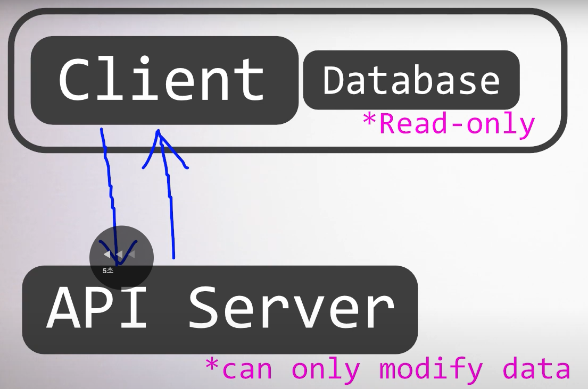

# JWT란

Json Web Token의 약자

* **HEADER**: 사용한 해쉬 알고리즘
* **PAYLOAD**: 담을 내용
* **SIGNATURE**: 서명(ID+PASSWORD)

### JWT 사용과정

1. 브라우저의 로그인 과정에서 회원 정보를 입력
2. 서버는 JWT를 생성
3. 서버는 브라우저에게 JWT를 전송
4. 브라우저는 JWT를 가지고 서버에게 데이터를 요청
5. 서버는 서명을 확인ㅇ하고 유저 정보를 클라이언트에 제공

### JWT 사용목적

* JWT를 이용해서 회원 정보를 주고받게 되면 유저의 정보를 세션에 유지할 필요가 없게 된다.
* 즉, `stateless`한 서버를 만들 수 있게 도와준다

### JWT 왜쓸까?

*   사용자가 점점 늘어나는 웹 서비스라고 가정

    * FE : 문제 없음
    * BE : ScaleOut(확장)하면 큰 문제 없음
    * DB: 병렬처리 하기가 쉽지 않음 설령 쉽더라도 비용이 비쌈.

    

    * 클라이언트에서 읽기는 가능하지만 서버를 통해서만 데이터를 수정하게끔
    * 데이터 관리를 직접 할 필요는 없어지니까 편함
* 조작되진 않을까?
  * 서버에서 `Signature`를 이용해 판별 가능함
  * 헤더와 페이로드를 이용해 조합하고 비밀키를 이용해 해쉬값을 만들어 내면 그게 시그니처임
  * 그럼 직접 만든 시그니처와 유저가 준 시그니처 값을 비교하면 이건 조작된 데이터를 의미함
* 비밀키?
  * 이 비밀키는 서버에서만 알고있음

### 꼭 JSON이어야할까?

* 프로그래밍 언어를 통해 유연하게 다룰 수 있기 때문에 JSON을 사용함

### 한계점?

#### Case 1. Token Expiration Issue

* 서버는 아무것도 저장을 하고있지 않음
* 중복 로그인에 대한 처리를 할 수가 없음
* 전체 초기화 외엔 방법이 없음

#### Case 2. JWT 유출

* 못쓰게 만들어야하는데 만료시킬 방법이 없음..
* 개인정보를 담고 있었다면 그대로 유출됐을거임

그래서 세션관리는 원래 하던대로 하되, JWT는 쿠키정도의 역할만 함

***

#### JWT payload - jti

[참고페이지](https://www.ibm.com/docs/ko/was-liberty/base?topic=uocpao2as-json-web-token-jwt-oauth-client-authorization-grants)

* 선택적 옵션이다
* JWT 토큰의 고유 ID이다
* 존재하는 경우 동일한 JWT ID를 재사용할 수 없다 (`일종의 중복로그인 개념`)

#### JWT palyload public/private claim?

* public claim은 사용자 마음대로 쓸 수 있으나 충돌 방지를 위해 [정의된대로 사용하는 것](https://www.iana.org/assignments/jwt/jwt.xhtml)이 좋다고 함
* private claim은 통신을 주고 받는 당사자들끼리 협의해서 자유롭게 키와 값을 정할 수 있음

***

### 출처

* [JWT 간단히 훑어보기](https://www.youtube.com/watch?v=7abbNwuCXbg)
* [JWT란](https://velog.io/@geunwoobaek/JWT%EB%9E%80)
